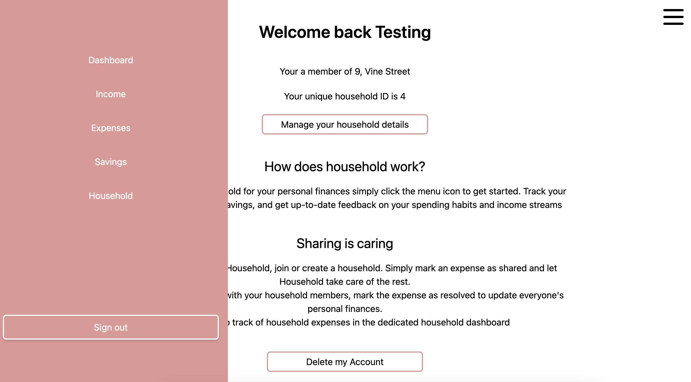
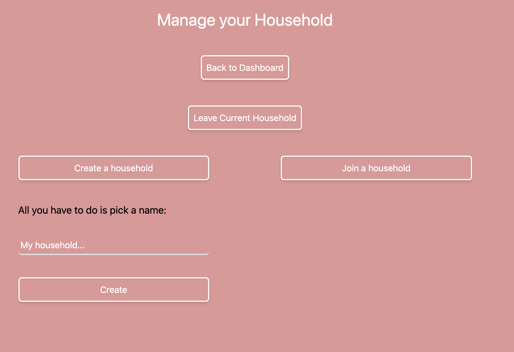
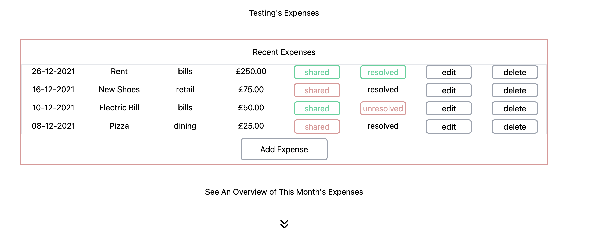
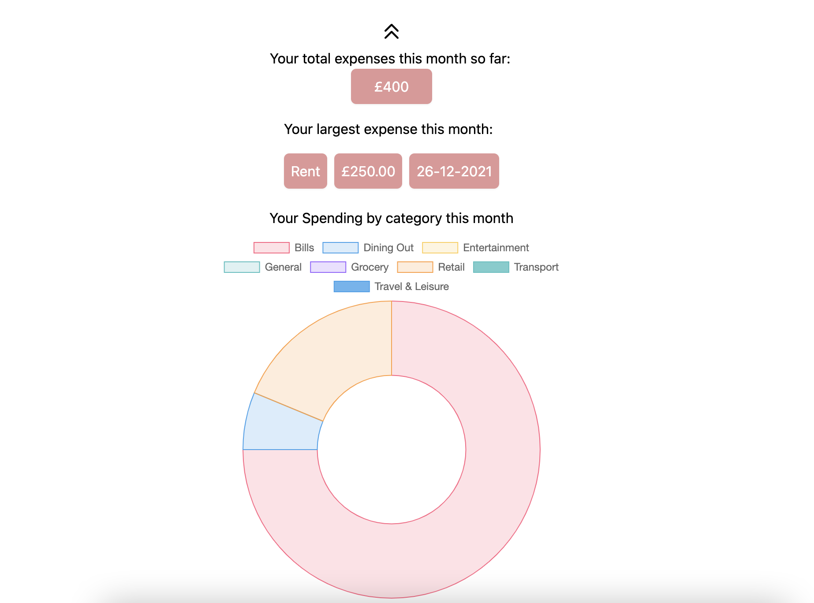
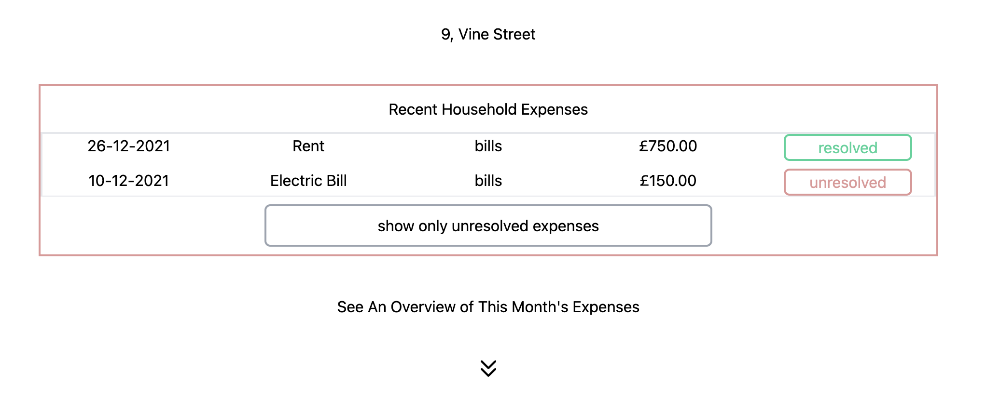
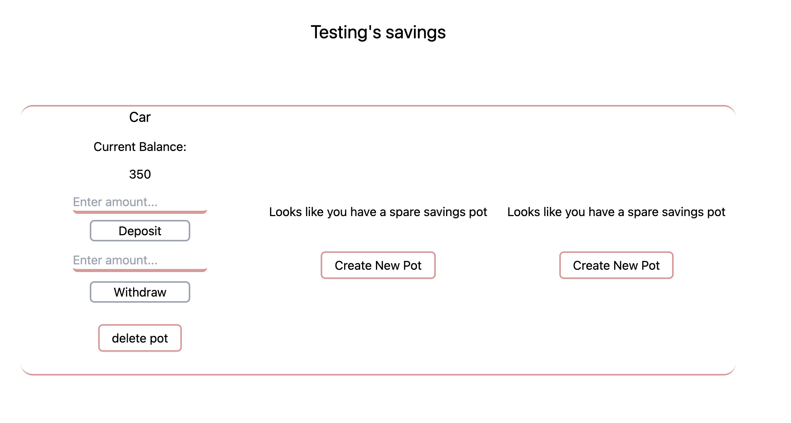
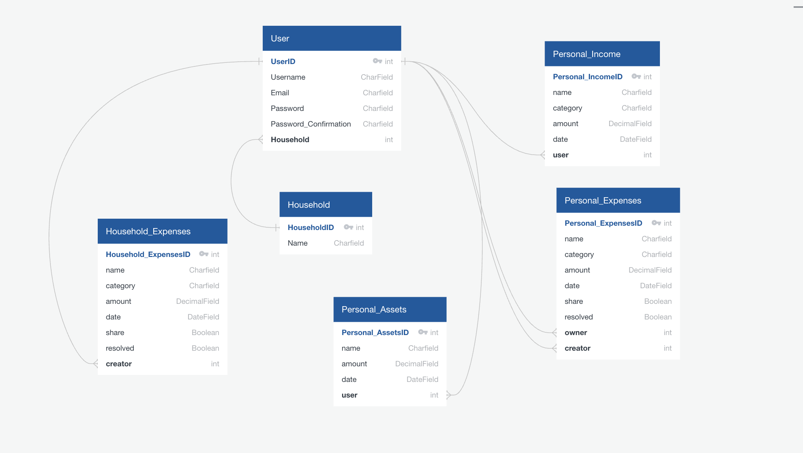
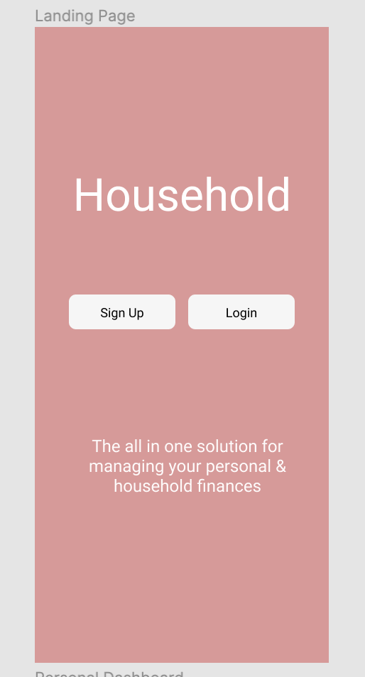
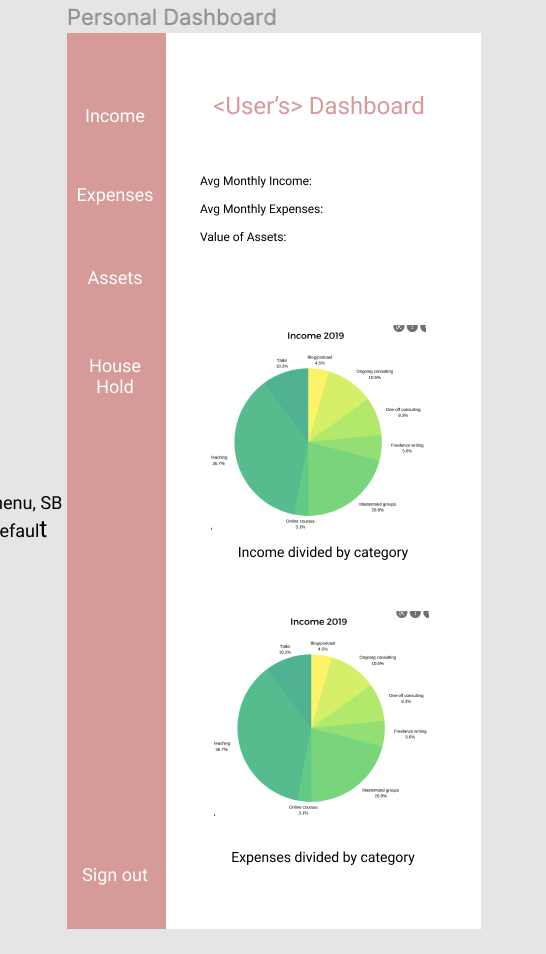
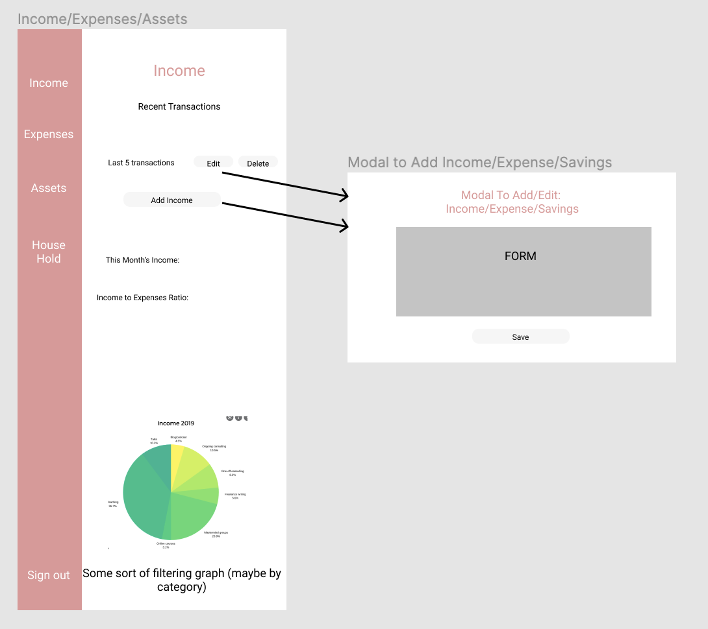

# Household - A Full Stack Django/React Web App 

### Deployed on Heroku [here](https://household-app-project.herokuapp.com/)


## Overview
Household was developed in fulfillment of General Assembly's Software Engineering Immersive Bootcamp. The brief was to create a full stack web application using an SQL database, Django backend, and React frontend, with a time-frame of nine days. Household is a financial management app in which a user can track their income, expenses, and savings. The user is also able to create a household with other users. Once created, the app will handle the distribution of household expenses among members proportionately, all the user has to do is mark the expense as 'shared' and the app will take care of the rest. Both individual user and household data are represented with charts and key insight are available on demand such as largest monthly expense and total monthly income. The app is fully mobile responsive.      

## Tech Stack 

* Django 
* Django REST Framework
* PostgreSQL
* React.js
* Axios
* React Query
* Tailwind CSS 
* Chart.js
* Figma


## App Snapshot 
Users are required to register in order to use the app. Once registered or signed in they are taken to the landing page; navigation is achieved via a side-bar which slides in & out:



The household management page allows a user to create a new household, join an existing one, or leave their existing household.



The income and expenses pages show a user's income & expenses, displaying their current status (shared, resolved etc.)



Clicking the downward arrow scrolls the page down to reveal data visualization and key stats 



The household expenses page keeps track of shared expenses



Users can create up to 3 savings pots, adding or withdrawing as required



## Planning
To help build the database I used an entity relationship diagram:



I built basic wireframes for key pages using Figma, some examples include:

Landing Page 


Dashboard


Personal Expenses



## Featured Code Snippet
The ability to mark an expense as 'shared' and have that expense split evenly amongst members of the household and included 
in a separate household table was my main MVP goal for the project. The following code snippet is the view that handles this 
functionality:  

```python 

class SEIndexView(APIView):
  
    def post(self, request):
        house_members = User.objects.filter(household=request.data['household']).exclude(id=request.data['creator']) 
        # grab the other members of the household from the User model, 
        # exclude the current user from the list
        serialized_house_members = UserSerializer(house_members, many=True)
        h_list = list(serialized_house_members.data) 
        # return the query as a list, will use for looping through later 
        shared_amount = (request.data['amount'] / (len(h_list) + 1)) 
        #calc the correct splitting of the expense including the user who shared it

#build out the correct structure for each post request 
# (1) the user's personal expenses, (2) the other members of the household's personal expenses, (3) the household expenses table 
        pe = {
        "name": request.data['name'],
        "category":request.data['category'],
        "amount": shared_amount,
        "date": request.data['date'],
        "share": request.data['share'],
        "resolved": request.data['resolved'],
        "owner": request.data['owner'],
        "creator": request.data['creator']
        }

        he = {
            "name": request.data['name'],
            "category":request.data['category'],
            "amount": request.data['amount'],
            "date": request.data['date'],
            "resolved": request.data['resolved'],
            "household": request.data['household'],
            "creator": request.data['creator']
        }
        try:
          personal_expense = PESerializer(data=pe)
          if  personal_expense.is_valid():
              personal_expense.save()
          household_expense = HESerializer(data=he)
          if  household_expense.is_valid():
              household_expense.save()
        except: 
          return Response(status=status.HTTP_422_UNPROCESSABLE_ENTITY)

# use the query list to send a post request to the personal_expenses table for each user in it 
        for index, person in enumerate(h_list):
            pse = {
                "name": request.data['name'],
                "category":request.data['category'],
                "amount": shared_amount,
                "date": request.data['date'],
                "share": request.data['share'],
                "resolved": request.data['resolved'],
                "owner": h_list[index]['id'],
                "creator": request.data['creator'],
            } 
            shared_personal_expense = PESerializer(data=pse)
            if  shared_personal_expense.is_valid():
                shared_personal_expense.save()
            else:
                return Response(status=status.HTTP_422_UNPROCESSABLE_ENTITY)

        return Response(status=status.HTTP_201_CREATED)


```


## Known Bugs

* On creating a new household, the user will be shown an updated household ID immediately, however the name of the new household will only show after the user has navigated away from the homepage and back again. This issue was fixed elsewhere by using React Query to optimistically update the UI, but has not yet been successfully implemented on this one particular update.

## Development Challenges & Wins

For my final project on General Assembly's Software Engineering Immersive Bootcamp I wanted to move away from building apps primarily focused on serving data to the user and towards something oriented around providing a service with a core functionality, something I would be keen to use myself; I landed on a personal finance app. Several of the main technologies used in this project (Django, Python, SQL) were new to me at the outset. Of the three, working with SQL was the most challenging conceptually, having only used MongoDB previously. I am sure that the relationships between tables could be streamlined and, in turn, the views that handle the HTTP requests from the front end similarly simplified. I attempted to embrace the 'single page app' aspect of React as much as possible, cutting down on routing and employing conditionally rendered UI components wherever possible. This lead to both UI (particularly with absolutely positioned elements) and data fetching challenges. On that note, I opted to use React Query to handle the cached data in the app. This again was definitely a challenge, whilst I still have more requests firing than I would like, I really enjoyed using React Query as a way to learn more about global state management, app structure, and data caching. 

Overall, I thoroughly enjoyed building the app. It was definitely a sprint to complete within the time-frame, but I enjoy this immersive style of working. The project gave me a much clearer understanding of the tradeoffs between database types; as well as between a 'batteries included' framework like Django and a lighter server-side framework such as Express. Getting the main 'shared expenses' functionality working correctly was extremely satisfying. I also designed the app 'mobile first', which was a great learning experience and an approach I will use more frequently in the future. I was able to dive deeper into Tailwind CSS and was much happier with the styling and responsiveness of this app in comparison to others I had built on the course.  


## Future Development

New features for the app are Household into a more rounded household planning solution by adding features such as: 

* Shared household savings pots 
* Household chores - customizable household chores that are distributed evenly among household members
* advanced data analysis - for example, data visualizations are currently restricted to the current month, adding quarterly or YTD analytics for personal and household expenses     

